# Fintech SQL Data Migration into Azure Portal

## Overview
This project focuses on migrating financial data from an SQL database into the Azure cloud ecosystem. The migration is structured into multiple layers to ensure data integrity and scalability using Azure services.

## Tech Stack
- **Azure**  Synapse Analytics, ADLS, Logic Apps
- **Azure SQL Database**
- **PySpark**
- **SQL**
- **Delta Tables**

## Infrastructure Setup
### Resource Group
- `fintech-data-migration`

### Storage Account
- Created `fintechdatamigration` with a `fintech` container
- Three folders: `bronze`, `silver`, and `gold`
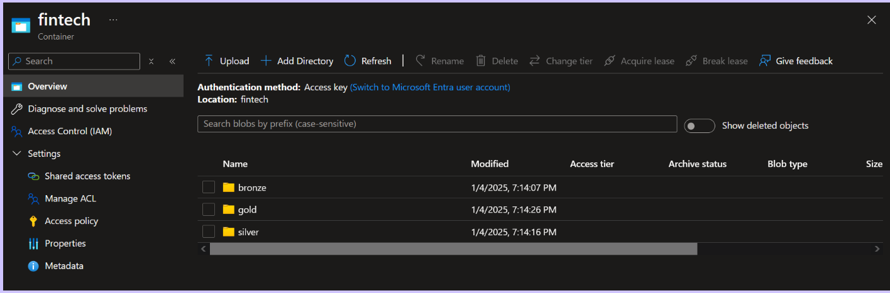

### SQL Database & Server
- **Database**: `fintechsqldb`
- **Server**: `fintechsqlserver`
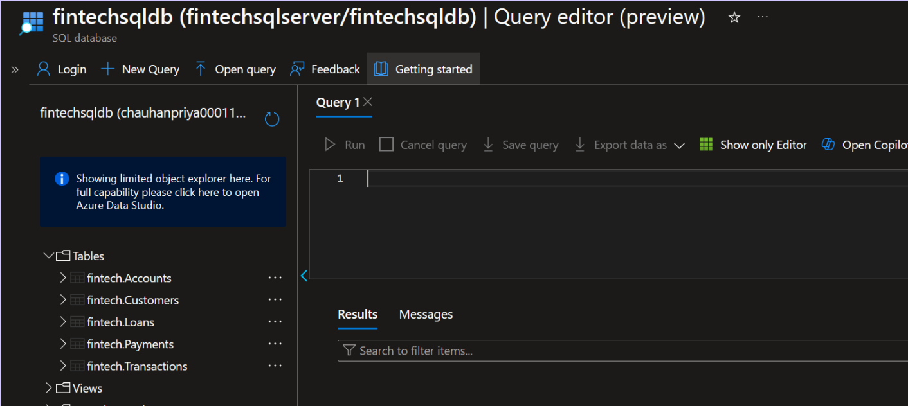

### Synapse Analytics
- **Workspace**: `synapse-ws-fintech`
- **ADLS Account**: `fintechdatamigration`
- **File System**: `synapse-data`
- **Spark Pool**: `fintechsparkpool`

## Data Pipeline Implementation
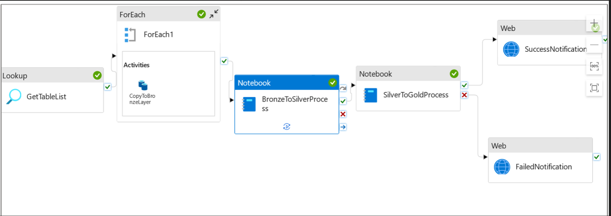

### Linked Services
1. **LS_SQLdatabase**
2. **LS-fintechdatalake** (Permission: Storage Blob Data Contributor)

### Datasets
1. **SQLSource**: Placeholder dataset for SQL tables
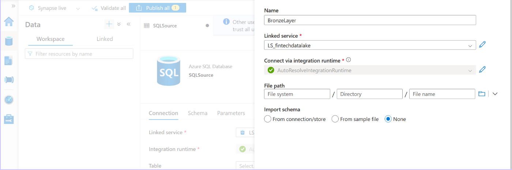

3. **BronzeLayer**: Parquet storage dataset
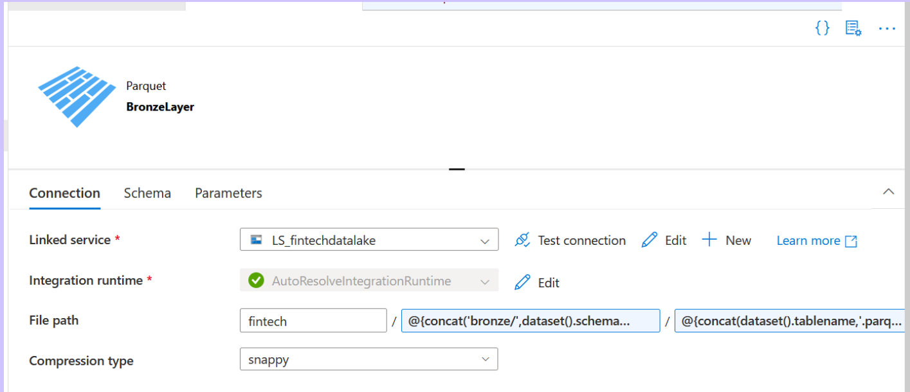

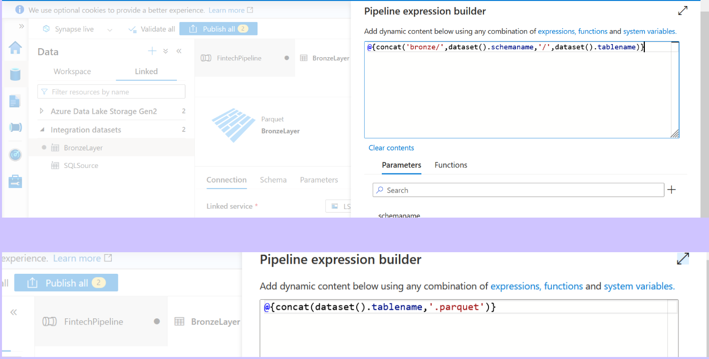

### Data Pipeline: `FintechPipeline`
1. **Lookup Activity** (`GetTableList`)
   - Retrieves a list of tables from `fintechsqldb`
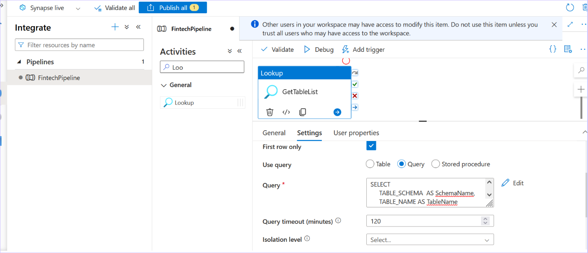

2. **ForEach Activity**
   - Iterates over tables and copies data to the Bronze layer
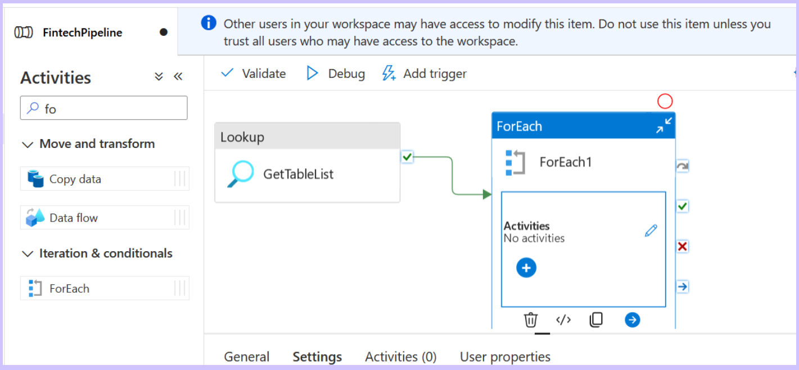
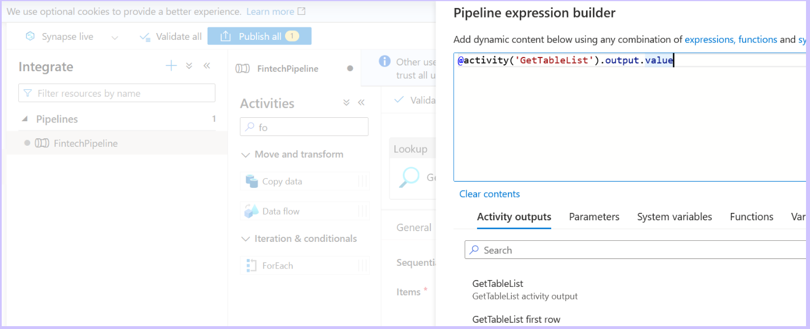

3. **Copy Activity** (`CopyToBronzeLayer`)
   - Extracts data from SQL tables and writes to ADLS in Parquet format
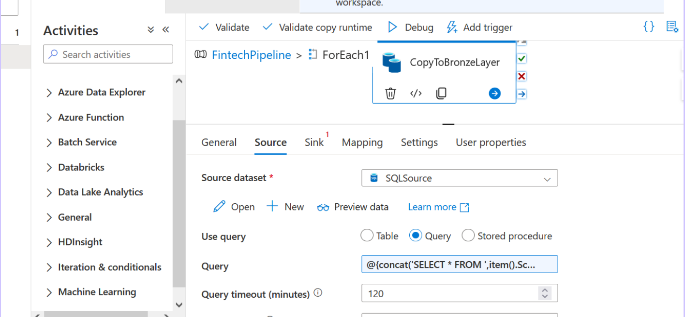
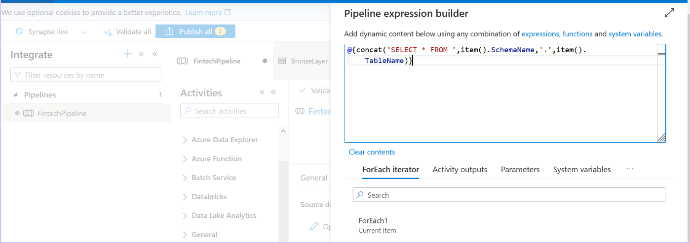
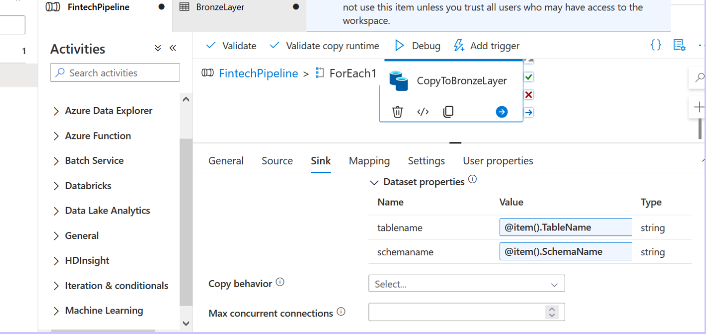

### Data Processing in Synapse (Bronze to Silver)
- **Notebook Activity** (`BronzeToSilverDataProcess`)
  - Uses PySpark for data transformations
  - Runs on `fintechsparkpool`
- **Notebook Activity** (`SilverToGoldDataProcess`)
  - Uses PySpark to create Business-Ready Data
  - Runs on `fintechsparkpool`

## Notification System
- **Web Activity** for sending execution notifications
  - **SuccessNotification**
  - **FailedNotification**
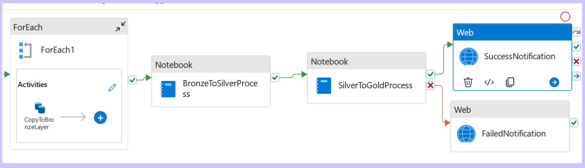
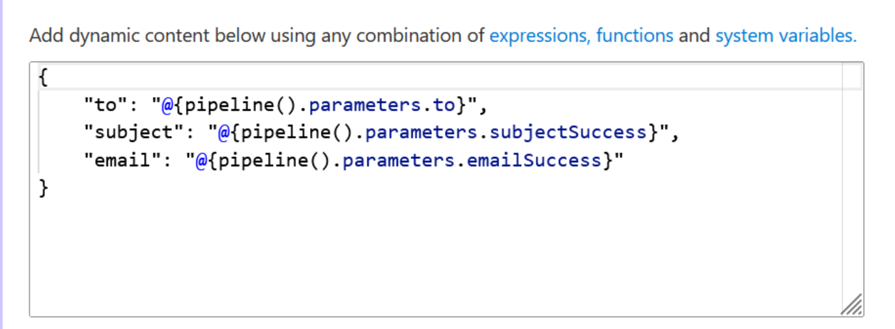
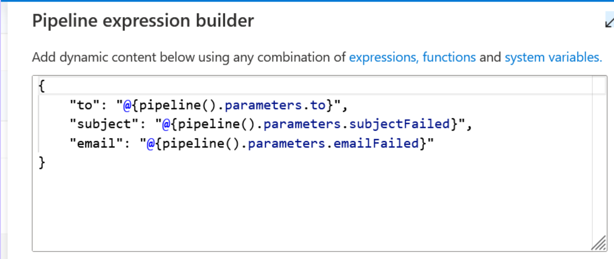

- **Logic App Integration**
  - HTTP Trigger to send emails via Outlook
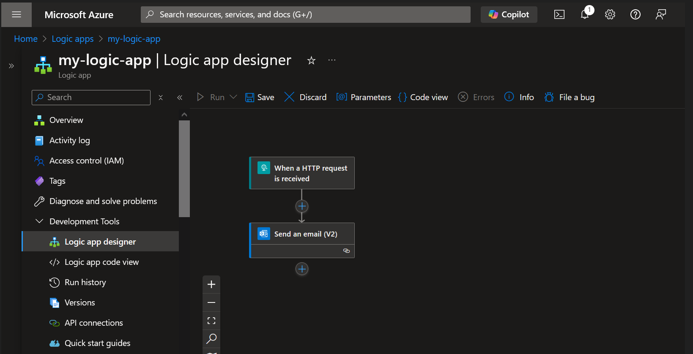
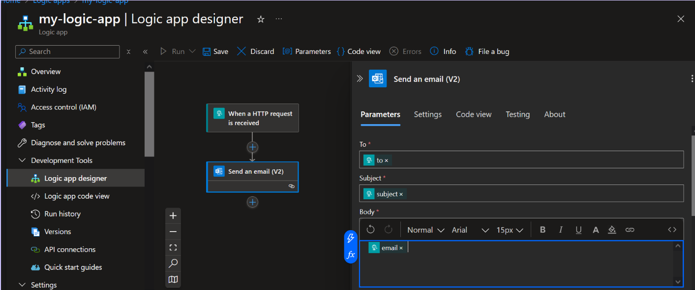

## Conclusion
This project provides an end-to-end Azure-based SQL data migration and transformation pipeline, ensuring scalability, security, and efficient data processing.
